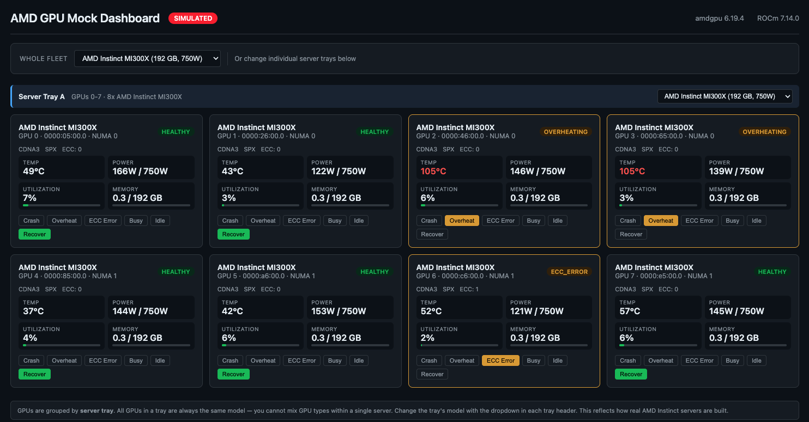

# amd-gpu-mock

Simulate AMD Instinct GPU infrastructure on CPU-only Kubernetes nodes.
No AMD hardware required.

Inspired by the Mokka GPU simulation framework.
Reach for amd-gpu-mock when your system **reads** hardware state and reacts
to it, and for real hardware when it **executes** work.

## What it does

Turns any laptop into an 8-GPU AMD Instinct MI300X cluster. The AMD GPU
Operator, device plugin, metrics exporter, and node labeller all run
against the mock — Kubernetes schedules GPU workloads and dashboards
show live telemetry, all without a single real GPU.

## Quick start

Requires kind v0.33.0+, kubectl, Helm, and Docker or Podman. Run from this checkout.

```bash
kind create cluster --name amd-mock \
    --image docker.io/submod/amd-mock-kind-node:0.2.2 \
    --config deployments/kind-node/kind-config.yaml

helm install amd-gpu-mock oci://docker.io/submod/amd-gpu-mock \
    --version 0.2.3 --namespace amd-mock --create-namespace
```

You now have eight mock MI300X GPUs available through DRA. See the
[DRA guide](docs/guides/dra.md) to request a GPU, or the
[device-plugin guide](docs/guides/device-plugin.md) for `amd.com/gpu` workloads.

Podman users: set `KIND_EXPERIMENTAL_PROVIDER=podman` before creating the cluster.

### Clean up

```bash
helm uninstall amd-gpu-mock --namespace amd-mock
kind delete cluster --name amd-mock
```

## Dashboard

The quick start exposes the dashboard at [localhost:8080](http://localhost:8080).

To use another host port, change the kind mapping before creating the cluster:

```bash
sed 's/hostPort: 8080/hostPort: 9090/' \
  deployments/kind-node/kind-config.yaml > /tmp/amd-mock-kind.yaml
kind create cluster --name amd-mock \
  --image docker.io/submod/amd-mock-kind-node:0.2.2 \
  --config /tmp/amd-mock-kind.yaml
# Install the chart as above, then open http://localhost:9090.
```



The dashboard shows all 8 GPUs with live metrics (temperature, power,
utilization, memory), fault injection controls (Crash, Overheat, ECC Error),
and fleet profile switching. GPUs are grouped by server tray matching
real OAM baseboard layouts.

## Grafana telemetry

```bash
# Prometheus + Grafana
helm repo add prometheus-community https://prometheus-community.github.io/helm-charts
helm install monitoring prometheus-community/kube-prometheus-stack \
  --namespace monitoring --create-namespace \
  --set grafana.adminPassword=amdmock \
  --set prometheus.prometheusSpec.serviceMonitorSelectorNilUsesHelmValues=false

# Enable ServiceMonitor for GPU metrics
helm upgrade amd-gpu-mock oci://docker.io/submod/amd-gpu-mock \
  --version 0.2.3 --namespace amd-mock \
  --set prometheus.serviceMonitor.enabled=true

# Import dashboard
kubectl apply -f deployments/grafana-dashboard.yaml

# Access Grafana
kubectl -n monitoring port-forward svc/monitoring-grafana 3000:80
open http://localhost:3000    # admin / amdmock
```

Prometheus scrapes 8 GPU metrics (`gpu_temperature`, `gpu_power`,
`gpu_gfx_activity`, `gpu_used_vram`, `gpu_total_vram`, `gpu_clock`,
`gpu_ecc_uncorrectable`, `gpu_power_cap`) every 15 seconds.

## LLM demo

```bash
kubectl apply -f deployments/dra/tiny-llm-demo.yaml
kubectl logs -l app=tiny-llm-dra
```

Deploys a scripted LLM simulation requesting one GPU through DRA. No model
weights or GPU inference run. For the device-plugin installation, use
`deployments/tiny-llm-demo.yaml` (`amd.com/gpu: 1`).

## GPU partitioning

This dashboard simulation is separate from DRA. The DRA integration exposes
full GPUs and does not implement compute-partition allocation.

The API models SPX/DPX/QPX/CPX state. In CPX mode it displays eight
virtual entries per MI300X, each with one eighth of the physical memory.
This does not change device-plugin capacity or provide independently
allocatable Kubernetes partitions:

```bash
# API displays 64 virtual entries for 8 physical GPUs
curl -X POST 'http://localhost:8080/api/partitions/set?mode=CPX'

```

For four concurrent workloads on physical GPUs, use the
[device-plugin installation](docs/guides/device-plugin.md), then apply
`deployments/partition-demo.yaml`.

| Mode | Partitions/GPU | Total GPUs | Memory/partition |
|------|---------------|------------|------------------|
| SPX | 1 | 8 | 192 GB |
| DPX | 2 | 16 | 96 GB |
| QPX | 4 | 32 | 48 GB |
| CPX | 8 | 64 | 24 GB |

## GPU fault injection

Inject GPU health changes from the dashboard or API:

```bash
# Crash 7 of 8 GPUs
for i in 0 1 2 3 4 5 6; do
  curl -X POST "http://localhost:8080/api/actions/crash?gpu=$i"
done

# Recover a GPU
curl -X POST 'http://localhost:8080/api/actions/recover?gpu=3'
```

## GPU profiles

| Profile | GPU | Memory | Architecture | TDP |
|---------|-----|--------|-------------|-----|
| `mi210` | AMD Instinct MI210 | 64 GB HBM2e | CDNA 2 | 300W |
| `mi250x` | AMD Instinct MI250X | 128 GB HBM2e | CDNA 2 | 500W |
| `mi300a` | AMD Instinct MI300A | 128 GB HBM3 | CDNA 3 | 550W |
| `mi300x` (default) | AMD Instinct MI300X | 192 GB HBM3 | CDNA 3 | 750W |
| `mi325x` | AMD Instinct MI325X | 256 GB HBM3E | CDNA 3 | 1000W |
| `mi350x` | AMD Instinct MI350X | 288 GB HBM3E | CDNA 4 | 1000W |
| `mi355x` | AMD Instinct MI355X | 288 GB HBM3E | CDNA 4 | 1400W |

## What it simulates

| Surface | What it provides |
|---------|-----------------|
| **KFD sysfs topology** | `/sys/class/kfd/kfd/topology/nodes/*/properties` — GPU discovery |
| **Device nodes** | `/dev/kfd` + `/dev/dri/renderD128..N` + `/dev/dri/card0..N` |
| **PCI sysfs** | Vendor `0x1002`, device IDs, NUMA nodes, root complex symlinks |
| **DRM sysfs** | xGMI hive IDs, device IDs, NUMA association |
| **Driver module** | `/sys/module/amdgpu/` — version, refcount, initstate, driver bindings |
| **Mock `libamd_smi.so`** | 185 symbols matching the real AMD SMI library |
| **CDI specs** | Container Device Interface specs matching `amd-ctk` format |
| **Dynamic metrics** | Time-varying temperature, power, utilization, clocks |
| **Prometheus metrics** | `/metrics` endpoint with per-GPU labels |

## What it does NOT simulate

We simulate the **control plane**, not the **data plane**:

- No HIP/ROCm kernel execution
- No real GPU memory allocation or DMA
- No KFD ioctl protocol
- No SR-IOV / virtual function passthrough

## Architecture

```
Profile YAML
    │
    ▼
Node Agent (DaemonSet)
    ├── KFD sysfs topology (/sys/class/kfd/...)
    ├── Device nodes (/dev/kfd, /dev/dri/renderD*, /dev/dri/card*)
    ├── PCI sysfs (/sys/bus/pci/devices/*)
    ├── Driver module (/sys/module/amdgpu/)
    ├── Mock libamd_smi.so (staged for consumers)
    ├── CDI specs → /etc/cdi/amd.json
    ├── Prometheus /metrics endpoint
    └── API server (:8080) + Web dashboard

KIND Node (docker.io/submod/amd-mock-kind-node)
    ├── amd-container-runtime (registered with containerd)
    ├── containerd: enable_cdi = true
    └── CDI spec dirs: /etc/cdi/, /var/run/cdi/
         │
         ▼ CDI path: containerd → amd-container-runtime → resolves CDI spec
         │           → injects /dev/kfd + libraries into containers
         │
    AMD GPU Operator (SIM_ENABLE mode)
    ├── Device Plugin      → reads mock sysfs → amd.com/gpu: 8
    ├── Metrics Exporter   → reads mock libamd_smi.so → Prometheus
    └── Node Labeller      → reads mock sysfs → GPU node labels
         │
         ▼
    Pods requesting amd.com/gpu get scheduled

Alternative allocator (device plugin disabled):
    AMD DRA Driver → ResourceSlices → ResourceClaims
        → kubelet PrepareResourceClaims → per-claim CDI spec
        → containerd injects the allocated device nodes
```

## Validation

See the [automated testing guide](docs/guides/testing.md) for the seven-profile
CI matrix, test prerequisites, assertions, and limits.

```bash
go test ./...
```

Cluster test commands and their prerequisites are in the
[testing guide](docs/guides/testing.md) and [DRA guide](docs/guides/dra.md).

## Tested consumers

| Consumer | What works | Guide |
|---|---|---|
| AMD GPU Operator (v1.5.0) | Controller, device plugin, metrics exporter, node labeller | [GPU Operator guide](docs/guides/gpu-operator.md) |
| AMD K8s Device Plugin | Physical GPU discovery and `amd.com/gpu` scheduling | [Device-plugin guide](docs/guides/device-plugin.md) |
| AMD GPU DRA Driver (v1.0.0) | 7-profile discovery; claim allocation, selectors, exact CDI device injection, deletion/reallocation, and lifecycle tests | [DRA guide](docs/guides/dra.md) |
| AMD SMI Python interface | Loads mock library, enumerates GPUs, returns "AMD Instinct MI300X" | — |
| Prometheus + Grafana | 8 GPU metrics scraped, "AMD GPU Mock Fleet" dashboard | See [Grafana telemetry](#grafana-telemetry) |

## Version matrix

| Component | Version | Repo |
|---|---|---|
| Kubernetes | v1.37.0 (release 0.2.2 target) | kind node image |
| kind | v0.33.0 or newer | Cluster creation |
| ROCm Platform | 10.0.0 | [ROCm/rocm-systems](https://github.com/ROCm/rocm-systems) |
| amdgpu driver | 6.19.4 | [ROCm/amdgpu](https://github.com/ROCm/amdgpu) |
| AMD SMI library | 27.0.0 | ROCm/rocm-systems |
| GPU Operator | v1.5.0 | [ROCm/gpu-operator](https://github.com/ROCm/gpu-operator) |
| K8s Device Plugin | v1.31.0.11 | [ROCm/k8s-device-plugin](https://github.com/ROCm/k8s-device-plugin) |
| GPU DRA Driver | v1.0.0 | [ROCm/k8s-gpu-dra-driver](https://github.com/ROCm/k8s-gpu-dra-driver) |
| Container Toolkit | v1.3.0 | [ROCm/container-toolkit](https://github.com/ROCm/container-toolkit) |

## Published artifacts

| Artifact | Location |
|---|---|
| KIND node image | `docker.io/submod/amd-mock-kind-node:0.2.2` |
| Helm chart (OCI) | `oci://docker.io/submod/amd-gpu-mock:0.2.3` |
| Mock container image | `docker.io/submod/amd-gpu-mock:v0.2.2` (AMD64/ARM64) |
| DRA driver image | `docker.io/submod/amd-gpu-dra-driver:v1.0.0-mock.3` (AMD64/ARM64; unchanged upstream source) |
| GPU Operator (SIM_ENABLE) | `docker.io/submod/gpu-operator-sim:latest` |
| GPU Operator fork | [github.com/sub-mod/gpu-operator](https://github.com/sub-mod/gpu-operator) |

### Rebuild and publish (maintainers)

```bash
scripts/build-images.sh          # build all three images for AMD64 and ARM64
scripts/build-images.sh --push   # publish image manifests and the OCI chart
```

The script pins AMD's driver and container-toolkit commits in
`scripts/release.env`, builds all binaries and the mock library, includes
upstream licenses, and packages the chart. End users do not run it.
See the [DRA test matrix and limits](docs/guides/dra.md#tests-and-evidence)
before assuming an optional DRA feature is supported.

## License

Apache License 2.0
