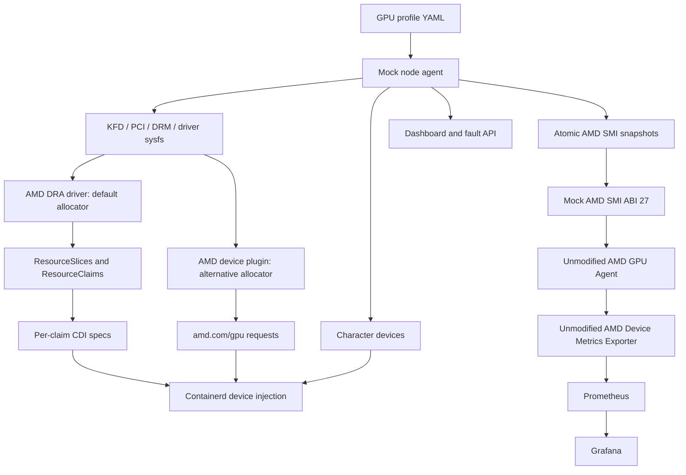

# Architecture

The mock supplies device contracts read by AMD software. It does not execute
HIP kernels, emulate GPU memory or implement KFD ioctls.

## System overview

DRA and the device plugin are mutually exclusive. Telemetry works alongside
either allocator and reads kubelet's real pod-resources socket for workload
labels. The optional Operator smoke path uses its own device plugin and node
labeller; disable both bundled allocators before using it.

## Node agent

The chart deploys a privileged DaemonSet. It stages mock sysfs under
`/var/lib/amd-gpu-mock/sys`, creates `/dev/kfd` and DRM character devices,
and writes CDI specs. KFD properties include vendor/device IDs, SIMD counts,
GFX targets and memory. PCI/DRM links supply physical identity and topology.
The staged driver module and bindings allow discovery without an AMD driver.

Profiles initialize runtime state. The simulator updates healthy temperature,
power, activity and clocks each second. Dashboard actions update that same
state and synchronize the staged sysfs and atomic AMD SMI snapshots. The
node agent also serves its own diagnostic `/metrics`; the real exporter
setup scrapes the separate AMD collector endpoint instead.

## Allocation and runtime

Chart 0.2.4 defaults to AMD's unchanged DRA v1.0.0 driver, republished for
AMD64 and ARM64. Its chart mounts mock sysfs at the driver's `/sys`. Kubernetes
allocates ResourceClaims; kubelet calls prepare/unprepare; the driver writes
per-claim CDI specs. Containerd injects only the allocated card/render devices
and shared `/dev/kfd`. See the [DRA guide](guides/dra.md).

The alternative device plugin reads the same sysfs and registers physical
GPU capacity as `amd.com/gpu`. See the [device-plugin guide](guides/device-plugin.md).

The published `amd-mock-kind-node:0.2.2` contains Kubernetes v1.37.0 and AMD's
container toolkit, with CDI enabled. Both allocation paths use this image.
Chart 0.2.4 uses node-agent image `amd-gpu-mock:v0.2.4`. The kind configuration
maps localhost:8080 to dashboard NodePort 30080 automatically.

## Telemetry

The optional chart exporter DaemonSet contains unchanged AMD v1.5.2 collector
binaries and a dedicated AMD SMI replacement compiled against the matching
GPU Agent ABI 27 header. It reads node-agent snapshots through a read-only
host mount. This replacement is separate from the legacy handwritten library
staged for other consumers. Unsupported APIs return NOT_SUPPORTED.

AMD's published collector is x86-64. AMD64 executes it directly; ARM64 uses
explicit QEMU emulation. Prometheus, Grafana, Kubernetes and the node agent
run natively. The ServiceMonitor preserves consumer labels and the provisioned
Grafana dashboard queries AMD metric names. See the [telemetry guide](guides/telemetry.md)
for setup, fault flows, tests, provenance and limitations.

## Operator scope

The published SIM_ENABLE controller fork bypasses driver init checks and
mounts mock sysfs for its plugin/labeller. The smoke test covers reconciliation,
readiness, capacity and device injection. This does not validate every
Operator operand. Operator-owned exporter, DRA and remediation remain separate
integration work; the tested real telemetry setup is the standalone chart
path. See the [Operator guide](guides/gpu-operator.md).

## Partitioning limits

SPX/DPX/QPX/CPX API transitions create virtual dashboard entries and divide
reported memory. They do not create independently schedulable partitions,
increase allocator capacity or implement AMD MxGPU/SR-IOV passthrough. Active
claims must not be combined with live profile changes. Profile/count changes
require consumer rediscovery and matching device nodes.
