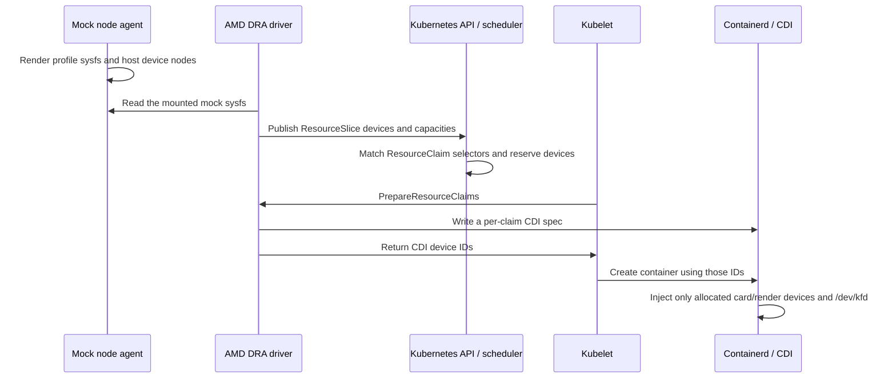

# Dynamic Resource Allocation (DRA)

The default README quick start installs DRA using the shared kind node image.
No separate cluster or driver installation is required.

DRA lets Kubernetes allocate devices through ResourceClaims instead of
extended resources such as `amd.com/gpu`. The mock supplies the sysfs and
device nodes that AMD's driver discovers. AMD's driver publishes devices,
Kubernetes allocates them, and kubelet asks the driver to prepare CDI specs
that containerd uses to inject the allocated devices.

## Use the default quick start: published images only

Install kind v0.33.0 or newer, kubectl v1.37, Helm, and a running Docker or
Podman runtime. Chart 0.2.13 / mock release 0.2.7 uses the 0.2.2 node image and supports Kubernetes 1.37 only. Linux
AMD64 and Linux ARM64 nodes are supported; Apple-silicon Macs run ARM64
nodes inside the container runtime's Linux VM. Internet access is needed
to pull images and the chart. No Go compiler or local image build is required.

Install using the [README quick start](../../README.md#quick-start), then verify
on that same cluster:

```bash
kubectl -n amd-mock rollout status ds/amd-gpu-mock --timeout=120s
kubectl -n amd-mock rollout status ds/amd-gpu-mock-dra-kubeletplugin --timeout=180s
kubectl get resourceslices
```

The chart includes the pinned AMD driver chart and uses a published multiarch
image built from AMD's unchanged v1.0.0 source. It mounts the mock sysfs tree
at the driver's `/sys`; no post-renderer or upstream source checkout is needed
for this install. DeviceClass `gpu.amd.com` is installed automatically.
DRA and the device plugin are mutually exclusive allocators. In DRA mode,
`amd.com/gpu` node capacity is not the check for success; ResourceSlices are.

From this project's checkout, the equivalent one-command demo is:

```bash
scripts/dra-setup.sh
# Uses a separate kubeconfig under tmp/; leaves other cluster contexts intact.
```

For an existing Kubernetes cluster, skip `kind create`. It must serve
`resource.k8s.io/v1`, allow the privileged mock/driver DaemonSets and hostPath
mounts, and have CDI enabled in its container runtime. Use Kubernetes 1.37;
the published node image runs v1.37.0. Older Kubernetes versions are not
supported by this release, even if they expose the v1 DRA API.
If limiting the mock to particular nodes, give both `nodeSelector` and
`dra.kubeletPlugin.nodeSelector` identical values. With a nondefault mock root,
also set `dra.mockSysPath` to `<mockRootDir>/sys`. The chart checks both rules.
NRI is disabled by default and is not part of the tested DRA allocation path.

## Claim a GPU

```yaml
apiVersion: resource.k8s.io/v1
kind: ResourceClaimTemplate
metadata:
  name: amd-gpu
spec:
  spec:
    devices:
      requests:
        - name: gpu
          exactly:
            deviceClassName: gpu.amd.com
---
apiVersion: v1
kind: Pod
metadata:
  name: dra-gpu-demo
spec:
  restartPolicy: Never
  terminationGracePeriodSeconds: 2
  containers:
    - name: demo
      image: docker.io/busybox:1.36
      command: ["sh", "-c", "ls -l /dev/kfd /dev/dri/; sleep 3600"]
      resources:
        claims:
          - name: gpu
  resourceClaims:
    - name: gpu
      resourceClaimTemplateName: amd-gpu
```

Save this as `dra-demo.yaml`, then:

```bash
kubectl apply -f dra-demo.yaml
kubectl wait pod/dra-gpu-demo --for=condition=Ready --timeout=180s
kubectl logs dra-gpu-demo
kubectl get resourceclaims
```

A one-GPU allocation gives the pod `/dev/kfd`, one `/dev/dri/cardN`, and
one `/dev/dri/renderDN`. Set `exactly.count: 2` to request two devices.
`deployments/dra/demo.yaml` in the source tree also includes a product selector:

```yaml
selectors:
  - cel:
      expression: device.attributes["gpu.amd.com"].productName == "AMD_Instinct_MI300X_OAM"
```

The default MI300X profile matches it. A nonmatching selector leaves the
claim unallocated and its consumer pod Pending.

## Discovery and allocation



The renderer provides:

- KFD topology, including SIMD counts and memory. AMD derives compute units
  from `simd_count / simd_per_cu`; profiles keep this consistent with CU count.
- DRM `product_name`, normalized by AMD into its `productName` attribute.
- Driver links so `cardN/device/driver/module/version` resolves to valid semver.
- PCI device links, NUMA nodes, and root-complex membership for every device,
  including all 16 MI250X dies.

A ResourceSlice advertises each device's PCI bus ID, PCIe root, product name,
driver version, NUMA node, and capacities. Publication alone does not prove
allocation works: the claim, kubelet preparation, CDI file, and device nodes
inside the consumer container must all succeed.

The project republishes upstream AMD source for both CPU architectures.
Its image adds no driver behavior changes. The vendored chart changes the
hardcoded `/sys` hostPath into a configurable value, normalizes chart metadata,
and selects the published image. Provenance and upstream license are included
in the chart and images.

## Release, explicit claims, and driver restarts

A pod using a ResourceClaimTemplate gets a generated claim owned by that pod.
Deleting the pod releases its reservation; kubelet asks AMD's driver to
unprepare it, removing the per-claim CDI spec. Kubernetes garbage-collects
the generated claim, and that GPU can be allocated to another claim.

An explicit ResourceClaim has a different lifetime. Deleting its consumer
pod leaves the claim object in place. After the last reservation is released,
Kubernetes deallocates the claim and kubelet removes its CDI spec. A later
consumer causes a new allocation, which may select a different GPU. Two pods
can reference the same explicit claim and share its allocation while they
are consuming it; independent claims remain exclusive.

The driver checkpoints prepared claims under its kubelet plugin directory.
Its CDI and checkpoint paths are host-mounted, so restarting the driver
preserves prepared allocation state. The lifecycle tests verify a running
consumer and a subsequent consumer after restart. A new pod can briefly
report `DRA driver gpu.amd.com is not registered` while kubelet reconnects;
the lifecycle test waits for recovery.

## Tests and evidence

The source tree includes:

```bash
# AMD's unmodified discovery package against every rendered profile.
# Linux: git, Go 1.24+, and mount namespaces or sudo.
# macOS: runs the same test in Docker/Podman's Linux VM.
tests/dra/discovery-check.sh

# Chart safety checks: allocator conflicts, sysfs roots, and node selectors.
tests/dra/chart-validation.sh

# Validate the driver installed by the published chart.
INSTALL_DRIVER=0 DRA_NS=amd-mock tests/dra/validate_dra.sh

# Focused blog scenarios: capacity, init/main sharing, PCIe-root constraints.
# Requires two free devices sharing a PCIe root on one healthy mock node.
python3 tests/dra/focused.py

# Run after other GPU-consuming test pods have been deleted.
# Requires a dedicated single-node cluster with at least two mock GPUs.
DRA_NS=amd-mock python3 tests/dra/lifecycle.py
```

Each script creates a separate unused test namespace. It cleans up its own
workloads unless `KEEP=1` is set. The lifecycle suite requires the whole pool
free at the start; delete the demo pod and earlier test namespaces first.
Set `KUBECONFIG` to the intended cluster before running any test.

| Case | Assertion |
|---|---|
| Chart configuration | Reject simultaneous allocators, mismatched sysfs roots, and mismatched node selectors |
| All-profile discovery | All 7 profiles / 60 GPUs match profile attributes |
| ResourceSlice publication | Every device on mock nodes has required attributes and capacities |
| One-GPU claim | Pod gets `/dev/kfd` and exactly one card/render character-device pair |
| Matching / nonmatching selectors | Match allocates; nonmatch remains unallocated |
| Generated claim deletion | Claim disappears after its pod is deleted |
| Memory capacity request | Exact advertised memory allocates; a 1-EiB request remains Pending and unallocated |
| Init/main sharing | One allocation; identical KFD/card/render paths and major/minor identities in both containers |
| PCIe-root constraints | Two distinct devices share the advertised root; contradictory distinct-root constraint stays unallocated |
| Same-GPU reallocation | A PCI bus ID selector reallocates the released GPU |
| Multi-GPU request | Two distinct GPUs and exactly two card/render pairs |
| Full-pool exhaustion | All GPUs allocate once; an additional claim cannot allocate |
| Pending claim after release | The waiting consumer starts when capacity is released |
| Explicit claim lifetime | Object remains; last-consumer deletion releases allocation; a new consumer reallocates |
| Shared explicit claim | Two consumers share the same allocation without taking another GPU |
| CDI cleanup | Per-claim spec disappears after unprepare |
| Driver restart | Existing allocation and CDI state survive restart |

Local validation uses ARM64 Linux in Podman on an Apple-silicon Mac. The
published quickstart was verified in a fresh cluster, and anonymous image
and chart pulls succeeded. The installed-driver basic suite passed 12 checks and the lifecycle
suite passed 9 checks. The standalone install mode adds a chart-remapping
check (13 basic checks). The
AMD64 GitHub Actions matrix tests both the source mock with AMD’s official
driver image and the published quickstart artifacts. It pins kind v0.33.0
and kubectl v1.37.0 for Kubernetes v1.37.0; older kind versions can generate
kubeadm configuration APIs that this Kubernetes version rejects.
This is a tested support matrix, not a claim that every DRA feature works.

## Limits and troubleshooting

- **Fixed DPX/NPS2 partitions are supported for MI300X.** See
  [same-GPU partition allocation](partition-allocation.md). CPX/QPX startup
  topology and AutoPartition management calls are not implemented.
- **No live device-health or hot-plug guarantee.** Discovery occurs at driver
  startup. Profile switches require driver restart and matching host device
  nodes; switching profiles while claims are active is not a supported workflow.
- **Not yet validated:** multi-node claim placement, node reboot/failure,
  topology-aware scheduling across nodes, optional DRA feature gates, and
  Kubernetes releases other than the tested version.
- **No GPU execution.** Device nodes prove scheduling/injection, not HIP,
  KFD ioctls, DMA, or real memory isolation.
- **Product names:** MI300X has the confirmed raw sysfs value; other profiles
  fall back to their display name.

If no ResourceSlice appears, inspect the driver logs:

```bash
kubectl -n amd-mock logs ds/amd-gpu-mock-dra-kubeletplugin -c plugin
kubectl -n amd-mock logs ds/amd-gpu-mock-dra-kubeletplugin -c driver-init
```

An empty driver version indicates an older mock image or missing driver links.
For a Pending consumer, inspect its ResourceClaim and pod events. A claim with
no allocation may have a nonmatching selector or an exhausted pool; a claim
with an allocation but a container creation error points to preparation/CDI.

## Cleanup and release builds

```bash
kubectl delete -f dra-demo.yaml
helm uninstall amd-gpu-mock --namespace amd-mock
kind delete cluster --name amd-dra
```

For the scripted setup, use `scripts/dra-setup.sh --teardown`.

Maintainers build and publish all required images and the OCI chart with:

```bash
scripts/build-images.sh          # local AMD64/ARM64 build
scripts/build-images.sh --push   # publish versioned manifests and chart
```

This requires Go, Git, Helm, Podman, registry authentication, and internet
access. The script pins upstream commits, builds both architectures, includes
licenses, and packages the chart. Users following the quick start do not run it.
Release pins are recorded in `scripts/release.env`. Do not overwrite an existing
release tag with different source; update the version and chart defaults together.

## Telemetry for DRA consumers

Chart 0.2.13 starts the [AMD telemetry pipeline](telemetry.md) by default.
The real exporter reads kubelet pod-resources to attach consumer pod, namespace
and container labels to allocated GPUs. Dashboard fault controls update the
same state read by AMD SMI; they do not promise DRA deallocation or remediation.

## Focused DRA blog scenarios

`tests/dra/focused.py` creates an unused `amd-dra-focused` namespace and
selects two available devices sharing a PCIe root on a healthy mock node.
It reads existing allocations across all namespaces and leaves other workloads
untouched. Set `FOCUSED_NS` to override the namespace or `KEEP=1` to retain
failed resources for inspection. The suite cleans up its namespace by default.

The five assertions cover three groups:

- **Capacity:** a request equal to the selected device's advertised memory
  must allocate and receive CDI devices; a 1-EiB request for that same device
  must receive a scheduling rejection and remain Pending without an allocation.
- **Sharing:** an init container and main container reference one claim,
  which must have exactly one allocation. Their logs must show identical
  KFD/card/render character-device identities, matching the allocated render ID.
- **Topology:** two requests selecting one advertised PCIe root must allocate
  distinct devices with that root using `matchAttribute`. Replacing it with
  `distinctAttribute` makes the requests contradictory; they must remain
  unallocated even though each selector independently matches available devices.

The pinned Kubernetes 1.37 capacity allocator compares capacity map keys
verbatim. AMD v1.0.0 publishes `memory`, so this suite requests `memory`,
rather than the blog's `gpu.amd.com/memory`. Capacity requests do not
create fractional devices or prove VRAM isolation. These tests exercise
scheduling and injection, not computation. CI runs this suite in both DRA
image configurations; adding it to CI does not establish a passing CI run.

### Capacity names: upstream mapping

For this project's pinned stack, use `capacity.requests.memory`. This is
version-specific, not a general rule that DRA names never have a driver prefix.

| Interface | Name in this stack | Why |
| --- | --- | --- |
| AMD ResourceSlice capacity map | `memory` | AMD v1.0.0's `GetDevice()` emits the unqualified key for whole GPUs and partitions |
| CEL selector | `device.capacity["gpu.amd.com"].memory` | Kubernetes' CEL adapter assigns unqualified keys to the publishing driver's domain |
| ResourceClaim capacity request | `memory` | Kubernetes v0.37.0's consumable-capacity allocator compares the request key directly with the capacity map |

Source references:

- [AMD v1.0.0 device publication](https://github.com/ROCm/k8s-gpu-dra-driver/blob/7bf0efa6704371a928b533fce8b33993631bdb8a/cmd/gpu-kubeletplugin/deviceinfo.go#L88)
- [Kubernetes v0.37.0 CEL namespace mapping](https://github.com/kubernetes/dynamic-resource-allocation/blob/v0.37.0/cel/compile.go#L345)
- [Kubernetes v0.37.0 literal capacity lookup](https://github.com/kubernetes/dynamic-resource-allocation/blob/v0.37.0/structured/internal/experimental/consumable_capacity.go#L109)

A local scheduler-only comparison on Kubernetes v1.37.0 confirmed that
`memory: 192Gi` allocated a GPU while `gpu.amd.com/memory: 192Gi` remained
unallocated with `FailedScheduling`. See the [captured mapping comparison](../../demo/dra/capacity-mapping.log).
This comparison does not assert successful container preparation; the original
cluster's mock agents were unhealthy. The focused suite additionally requires
CDI device visibility for its positive capacity case. Future Kubernetes
versions may normalize both spellings; recheck their allocator before changing
this example. No ResourceSlice or claim status was patched for the comparison.

The focused suite passed **5/5 checks** on the rebuilt ARM64 Kind cluster
using published chart 0.2.13, mock image v0.2.7 and the unchanged AMD v1.0.0
driver. See [actual output](../../demo/dra/focused-tests.log). This includes
container preparation and device injection, beyond the scheduler-only
name-mapping comparison. The earlier mock-agent restart failure was corrected
and covered by a character-device restart regression test.
