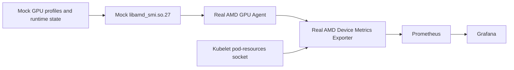

# AMD Device Metrics Exporter telemetry

The telemetry pipeline uses the **real AMD Device Metrics Exporter and GPU Agent** from AMD release v1.5.2. The mock replaces their AMD SMI device-library dependency. Prometheus and Grafana remain standard upstream components.



This follows the same principle as [NVIDIA Moka](https://github.com/NVIDIA/k8s-test-infra): simulate the vendor device interface and keep its consumers real. NVIDIA DCGM Exporter obtains telemetry through DCGM; AMD's exporter talks to GPU Agent, which invokes AMD SMI. These are different implementations, rather than interchangeable libraries.

## Default dashboards (chart 0.2.6+)

The default chart installs the real AMD exporter, Prometheus and Grafana.
The shared kind configuration maps the mock dashboard to localhost:8080 and
Grafana to localhost:3000. No port-forward or separate monitoring installation
is required. Sign in to Grafana with `admin` / `amdmock` and open
**AMD GPU Fleet — Device Metrics Exporter**.

For a complete published-image setup and a single file controlling dashboard
ports and enable switches, use [the demo setup](../../demo/README.md).
The built-in Prometheus discovers every exporter endpoint through a headless
Service and DNS discovery; it does not need Prometheus Operator CRDs. GPU
consumer labels are preserved. Storage is ephemeral and retention is 24 hours.

Set `monitoring.grafana.enabled=false` to omit Grafana, or
`monitoring.enabled=false` to omit both built-in monitoring applications.
`dashboard.enabled=false` removes the mock dashboard's host exposure.
`metricsExporter.enabled=false` also requires `monitoring.enabled=false`.
The plain kind file controls mappings only; use `demo/config.yaml` with
`demo/setup.sh` to coordinate mappings and workloads. Existing kind mappings
cannot change on a Helm upgrade.

## Optional external Prometheus Operator stack

For kube-prometheus-stack integration instead of the built-in applications:

```bash
./scripts/setup-monitoring.sh
kubectl -n monitoring port-forward svc/monitoring-grafana 3000:80
```

The script preserves your profile and allocator settings, disables bundled
monitoring, enables the exporter ServiceMonitor, installs pinned
kube-prometheus-stack chart 92.0.0, and provisions the same dashboard. It does
not scrape the mock agent's `/metrics` endpoint. If host port 3000 is already
in use, choose another port for this optional port-forward. Set
`GRAFANA_ADMIN_PASSWORD` to select an external Grafana password. End users
need no compiler, AMD checkout or custom image build.

Published inputs:

| Component | Version |
| --- | --- |
| Mock node agent | `docker.io/submod/amd-gpu-mock:v0.2.4` |
| AMD collector with mock SMI backend | `docker.io/submod/amd-device-metrics-exporter:v1.5.2-mock.2` |
| Mock Helm chart | `0.2.7` |
| Existing Kubernetes node image | `docker.io/submod/amd-mock-kind-node:0.2.2` |

Images support Linux AMD64 and ARM64. AMD's published collector binaries are x86-64: the ARM64 runtime explicitly executes them using QEMU. The GPU Agent and exporter binaries are unchanged; ARM64 collector execution is emulated, while the mock node agent, Kubernetes, Prometheus and Grafana run natively. This costs more CPU than a native collector.

## Device state and ABI

The node agent writes atomic per-GPU snapshots beneath `/var/lib/amd-gpu-mock/smi`. Profiles, runtime changes and fault injection update this same state. The AMD SMI library reads it when AMD's GPU Agent requests device telemetry. It does not construct Prometheus responses or substitute the GPU Agent RPC service.

The replacement is compiled against the unmodified AMD SMI header in GPU Agent release-v1.5.2. Its backend uses official ABI 27 types and is separate from the older handwritten mock used elsewhere. Header provenance is recorded in `pkg/mocksmi/exporter/UPSTREAM.md`; unsupported capabilities return AMD's `AMDSMI_STATUS_NOT_SUPPORTED`.

Temperature APIs return millidegrees Celsius; the exporter presents Celsius. Memory-total/usage APIs return bytes, while AMD VRAM-info/usage structures use MiB. Power information uses watts; power-cap information uses microwatts. The dashboard converts the exporter's MiB VRAM values to bytes for display.

Human-readable profile IDs are converted into stable canonical hexadecimal UUIDs for AMD GPU Agent. GPU identity comes from the same profile PCI BDFs and DRM card/render indices used for allocation. The exporter mounts mock sysfs and kubelet's real pod-resources socket to associate metrics with scheduled consumers. Its read-only state mount keeps telemetry collection separate from fault injection.

## Inject ECC errors from the dashboard

Open the mock dashboard at `http://localhost:8080` and use the ECC error control for a GPU. The control toggles the simulated uncorrectable ECC fault; use it again to clear the fault. No separate injection command is required.

The dashboard posts to `/api/actions/ecc-error?gpu=N`. The node agent updates that GPU's shared state, AMD SMI exposes the error to the real GPU Agent, and the exporter publishes `amd_gpu_ecc_uncorrect_total`. Prometheus and Grafana reflect the change after collection and scraping. Clearing a simulated fault resets its mock count; this is a simulation control, not hardware repair.

The integration test invokes the same dashboard action, waits for the ECC count to increase in Prometheus, toggles the fault off, and verifies recovery. This validates the action's backend and telemetry pathway; it does not automate a browser click.

## Other dashboard actions

The six per-GPU buttons use the same state bridge:

| Action | Observable exporter values |
| --- | --- |
| Overheat | Edge temperature becomes 105°C by default; junction and memory temperatures follow the mock's offsets. |
| Busy | GPU activity, power, used VRAM and graphics clock increase. |
| Idle | Used VRAM returns to the profile baseline and activity returns to idle. |
| Crash | Power, activity and clocks become zero. |
| Recover | Profile defaults and healthy status are restored, then normal dynamic simulation resumes. |
| ECC Error | Uncorrectable ECC count increases; toggling again clears it. |

Dynamic simulation varies healthy temperature, power, clocks and utilization each second. Prometheus collection and scraping introduce a delay; the dashboard reads the node agent directly. Fault status text is not itself an exported AMD metric. Crash currently changes device readings rather than making AMD SMI return a device-lost error. Health-service events, automatic remediation and alert rules are not enabled by this monitoring setup.

Fleet profile changes re-render the device state, but changes in GPU count require collector reinitialization. Per-tray profile switching does not yet perform the same immediate renderer synchronization, so it is not covered by the fault-action guarantee.

## Metrics and troubleshooting

The `amd_` prefix is configured explicitly. Representative queries:

```promql
amd_gpu_nodes_total
amd_gpu_edge_temperature
amd_gpu_package_power
amd_gpu_gfx_activity
amd_gpu_total_vram
amd_gpu_used_vram
amd_gpu_ecc_uncorrect_total
```

```bash
kubectl -n amd-mock get pods -l app.kubernetes.io/name=amd-gpu-mock-metrics-exporter
kubectl -n amd-mock logs daemonset/amd-gpu-mock-metrics-exporter
kubectl -n amd-mock exec daemonset/amd-gpu-mock-metrics-exporter -- \
  cat /var/log/exporter.log
kubectl -n amd-mock port-forward svc/amd-gpu-mock-metrics-exporter 5000:5000
curl http://localhost:5000/metrics
```

A log message `AMD SMI ABI 27 backend initialized` confirms the replacement library loaded. In Prometheus, verify the exporter target is `UP`. If a Grafana panel is empty, check the metric's existence and its `amd_` prefix before changing the panel query.

The optional external monitoring values use upstream GHCR Prometheus Operator images and upstream Docker Hub Prometheus/Grafana images. They avoid depending on locally cached images or Quay connectivity. Host node-exporter, Alertmanager and kube-state-metrics are omitted from this GPU-focused setup.

## Validation and builds

```bash
./tests/telemetry/abi.sh
# Default chart: Grafana is already exposed on port 3000.
kubectl -n amd-mock port-forward svc/amd-gpu-mock-prometheus 9090:9090
python3 tests/telemetry/e2e.py
```

The ABI suite checks structure compatibility, units, enumeration, buffer bounds, unsupported APIs and concurrent calls. The integration suite checks GPU identities and values, target health, dashboard ECC injection and recovery, Grafana provisioning and dashboard queries. Allocation lifecycle tests remain in the DRA and device-plugin suites.

Maintainers build and publish both architectures and the chart with:

```bash
./scripts/build-telemetry-images.sh --push
```

ASIC metadata, PCIe limits and clock ranges currently use MI300X constants; the live telemetry matrix uses the default MI300X profile. Other profiles are validated for allocation discovery, not complete exporter metadata fidelity.

This is simulated device telemetry. It does not demonstrate GPU computation, actual power draw, kernel driver behavior, or complete support for AMD SMI's control and profiler APIs.

References: [AMD exporter source](https://github.com/ROCm/device-metrics-exporter/tree/v1.5.2), [AMD GPU Agent](https://github.com/ROCm/gpu-agent), [AMD Prometheus/Grafana integration](https://instinct.docs.amd.com/projects/device-metrics-exporter/en/release-v1.5.2/integrations/prometheus-grafana.html), [NVIDIA DCGM Exporter](https://docs.nvidia.com/datacenter/dcgm/latest/reference/command-line-reference/dcgm-exporter.html).
